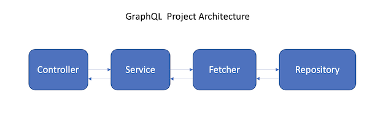

### GraphQL Blog

### Reference Documentation
For further reference, please consider the following sections:

* [Official Graphql Java documentation](https://www.graphql-java.com/documentation/)

### Guides
The following guides illustrate how to use some features concretely:

* [Building a RESTful Web Service](https://spring.io/guides/gs/rest-service/)
* [GraphQL Java implementation](https://github.com/graphql-java/graphql-java)
* [Getting started with GraphQL Java and Spring Boot](https://www.graphql-java.com/tutorials/getting-started-with-spring-boot/)

### Spring Boot microservice is using  

* [Embedded Tomcat](https://spring.io/blog/2014/03/07/deploying-spring-boot-applications)
* [Embedded H2 database](https://github.com/h2database/h2database)

### After the microsrvice start service provide 

* [POST http://localhost:9876/blog/graph](http://localhost:9876/blog/graph)
* [h2database Web UI](http://localhost:9876/blog/h2/)

### Tables created on h2database

```json
CREATE TABLE user(
  id INT PRIMARY KEY AUTO_INCREMENT,
  username VARCHAR(50) NULL,
  password VARCHAR(50) NULL,
  role enum('author','admin') DEFAULT NULL,
  token VARCHAR(500) NULL,
  created_at VARCHAR(50) NULL
);
  
CREATE TABLE post(
  id INT PRIMARY KEY AUTO_INCREMENT,
  user_id INT DEFAULT NULL,
  title VARCHAR(255) NOT NULL,
  views INT(11) NOT NULL DEFAULT '0',
  body text NOT NULL,
  published tinyint(1)  NULL,
  created_at VARCHAR(50) NULL,
  updated_at VARCHAR(50) NULL, 
  FOREIGN KEY (user_id) REFERENCES user (id)
); 

SELECT u.username, u.role, p.title, p.views 
FROM USERS u 
LEFT JOIN POSTS p ON u.ID = p.ID

```

### GraphQL Schema
   
All the functionality is on type Query


```json
schema{
 query:Query
}

type Query{  
  user(id: String): User
  allUser: [User]
  allPost: [Post]
  login(username: String, password: String): Token
  saveUser(username: String, password: String, role: String): Status
  savePost(title: String, body: String, views: Int, published: Int): Status
}

type User{
  id: String
  username: String
  role: String
  token: String
  created_at: String
}

type Post{
  title: String
  body: String
  views: Int
  published: Int
  created_at: String
  updated_at: String
}


type Token{
   token: String
}


type Status{
   status: String
}

```

## How to use the GraphQL API


[POST] http://localhost:9876/blog/graph

Payload example

```json
{

     login(username:"estevam", password:"123"){
        token
    }

    saveUser(username:"estevam2", password:"321", role:"admin"){
       status
    }

    savePost(title: "title", body: "321", views: 1, published: 0){
       status
    }

    user(id:"1"){
        username
        role
    }

   allUser{
       id
       username
       role
       token
       created_at
   }

   allPost{
       title
       body
       views
       published
       created_at
       updated_at
   }

}
```



